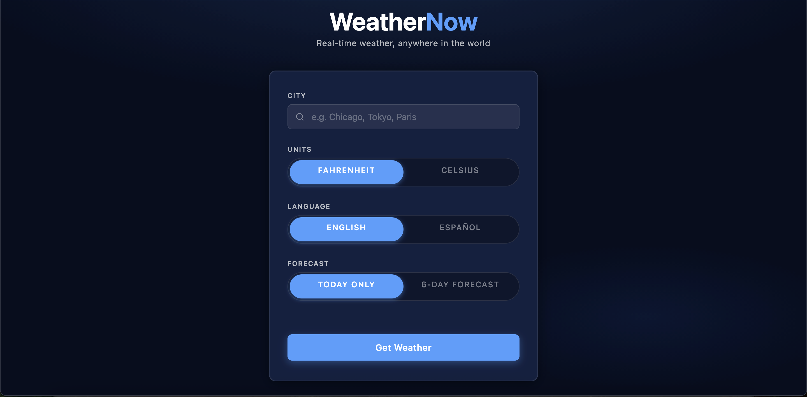
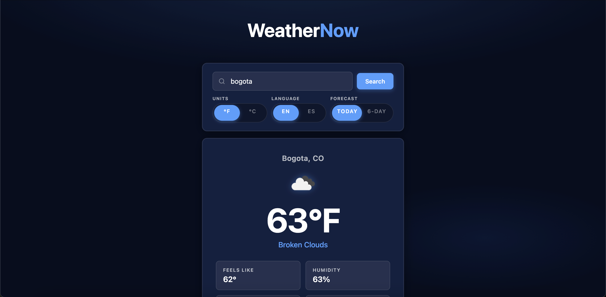
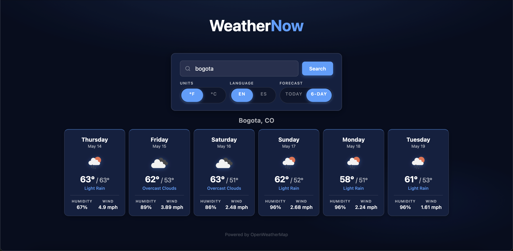

# WeatherNow

A clean, responsive weather app that delivers real-time conditions and multi-day forecasts for any city in the world.

## Live Site

### [weathernow-sih1.onrender.com](https://weathernow-sih1.onrender.com)

No setup required — open the link and start searching.

---

## Screenshots

**Homepage**


**Today's Forecast**


**6-Day Forecast**


---

## Features

- **Current weather** — temperature, condition, feels-like, humidity, wind speed, visibility, pressure, and high/low
- **6-Day forecast** — daily cards with weather icon, high/low temps, condition, humidity, and wind
- **Unit toggle** — switch between Fahrenheit and Celsius
- **Language toggle** — weather descriptions in English or Spanish
- **Sliding pill toggles** — smooth animated UI controls
- **Responsive design** — works on desktop, tablet, and mobile
- **Dark navy theme** — clean, modern color scheme

---

## Tech Stack

| Layer | Technology |
|---|---|
| Runtime | Node.js |
| Framework | Express |
| Templating | EJS |
| HTTP Client | Axios |
| Weather Data | OpenWeather API |
| Styling | Custom CSS (no framework) |

---

## Local Development

<details>
<summary>Setup instructions</summary>

### Prerequisites
- Node.js v18+
- An [OpenWeatherMap API key](https://openweathermap.org/api)

### Installation

```bash
git clone https://github.com/your-username/weathernow.git
cd weathernow
npm install
```

Create a `.env` file in the project root:

```
OPENWEATHER_API_KEY=your_api_key_here
```

```bash
npm run dev   # development with auto-restart
npm start     # production
```

</details>
